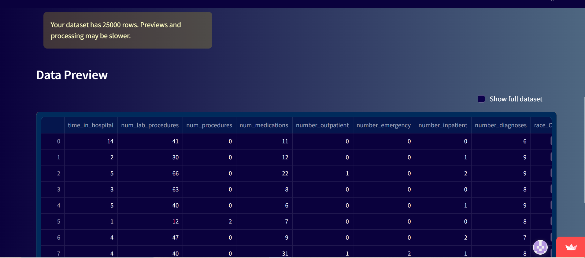
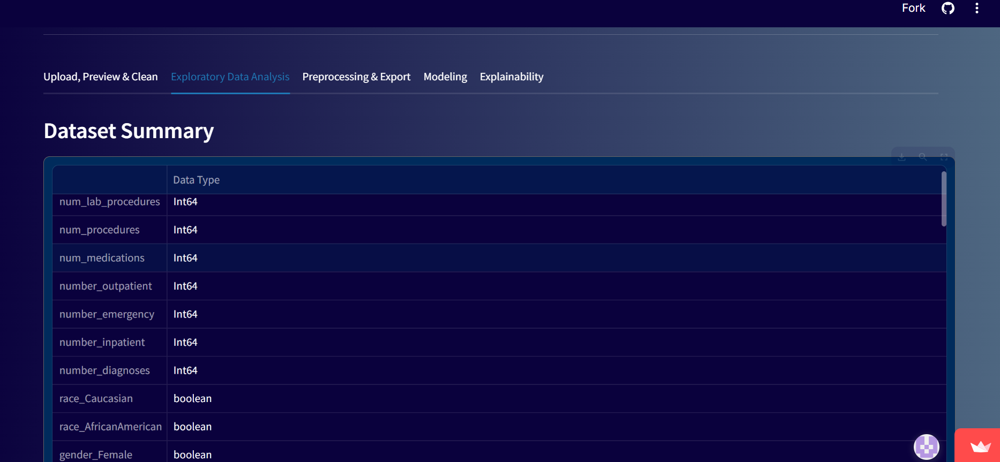
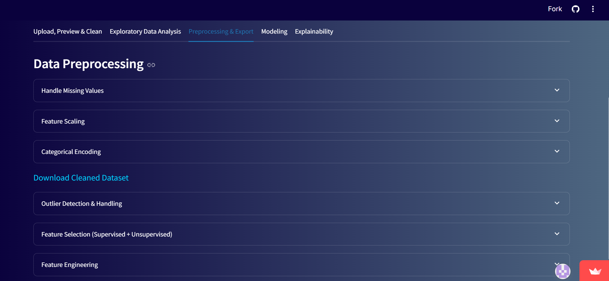
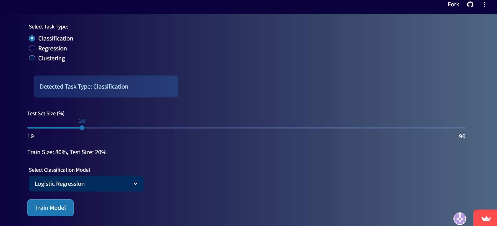
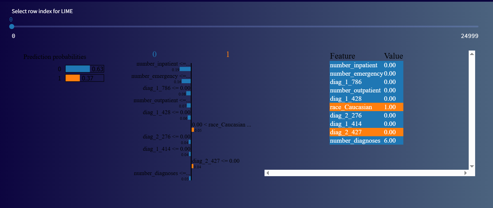

# 🚀 AutoNexus — Streamlined AutoML & Explainability App

[](https://autonexus.streamlit.app/)

**AutoNexus** is a lightweight, no-code AutoML web app built with **Streamlit**. It enables users to upload datasets, perform exploratory data analysis, preprocess data, train models, and explore model interpretability using **SHAP**, **LIME**, and **EBM** — all from a sleek UI.

---

## 🔍 Features

- 📁 Upload any CSV dataset
- 🧹 Auto data cleaning & preprocessing
- 📊 EDA visualizations using Seaborn & Matplotlib
- ⚙️ Model training:
  - Logistic/Linear Regression
  - Decision Trees, Random Forest
  - XGBoost, KNN, Naive Bayes
  - Explainable Boosting Machines (EBM)
- 📊 Model evaluation metrics & classification report
- 🧠 Explainability (LIME, SHAP, EBM)
- 🧪 Handle class imbalance (SMOTE, under/over sampling)
- 💾 Download trained models

---

## 🔗 Live Demo

[Click here to try AutoNexus on Streamlit Cloud](https://autonexus.streamlit.app/)

---

## 📸 Screenshots

### 🔹 Upload & Clean Data


### 🔹 EDA Summary


### 🔹 Pre-Processing


### 🔹 Model Training


### 🔹 LIME Explanation


> ℹ️ Store these images in a `/screenshots` folder in your GitHub repo.

---

## 📦 Requirements

Tested with **Python 3.10** and:
```txt
streamlit==1.44.1
pandas==2.2.3
numpy==1.23.5
matplotlib==3.10.1
seaborn==0.13.2
scikit-learn==1.2.2
scipy==1.15.2
imbalanced-learn==0.11.0
xgboost==1.6.2
shap==0.41.0
lime==0.2.0.1
interpret==0.2.7
joblib==1.4.2
plotly==6.0.1
```

---

## 🚀 Run Locally

```bash
# Create virtual environment (optional)
python -m venv venv
source venv/bin/activate  # or venv\Scripts\activate on Windows

# Install dependencies
pip install -r requirements.txt

# Launch the app
streamlit run app.py
```

---

## ☁️ Deploy on Streamlit Cloud

To deploy this project, make sure your repo has:

- `requirements.txt` with compatible versions (see above)
- `.streamlit/runtime.txt` with:
  ```
  python-3.10
  ```

Then go to 👉 [https://streamlit.io/cloud](https://streamlit.io/cloud) and deploy your app.

---

## 🙋‍♀️ Author

**Srilekha Tirumala Vinjamoori**  
MS in Information Systems | UTA  
📫 [LinkedIn](https://www.linkedin.com/in/srilekha-tirumala-vinjanoori/)  
🌐 [Portfolio](https://srilekhatv-portfolio.vercel.app)

---

## 📄 License

MIT License